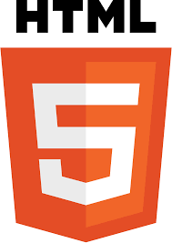
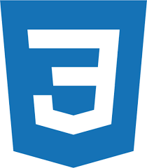
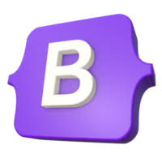
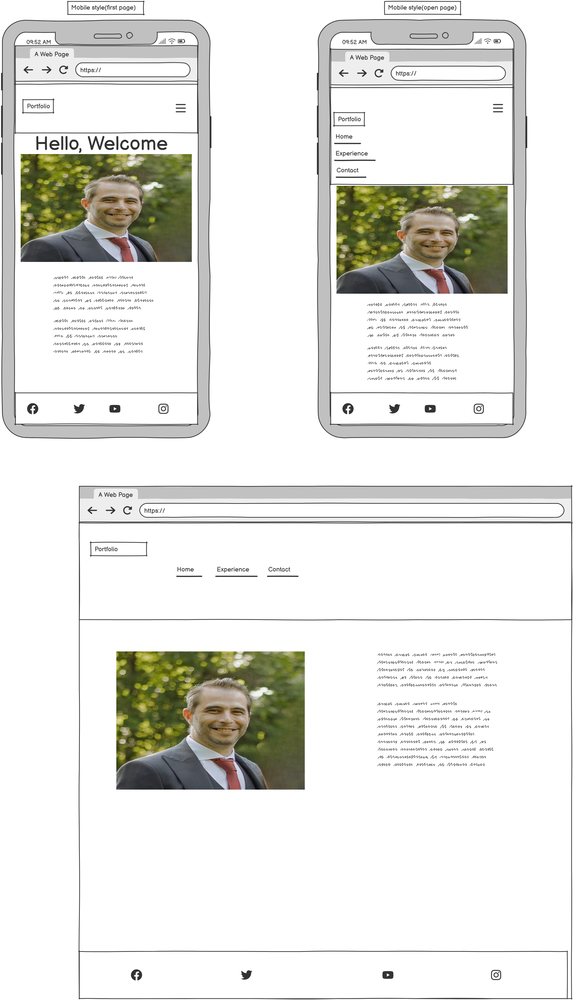
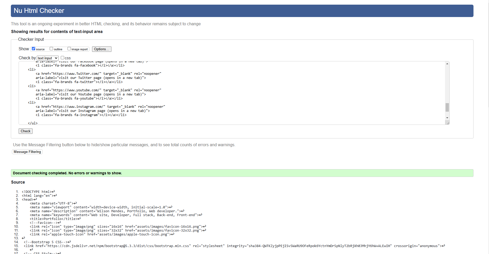
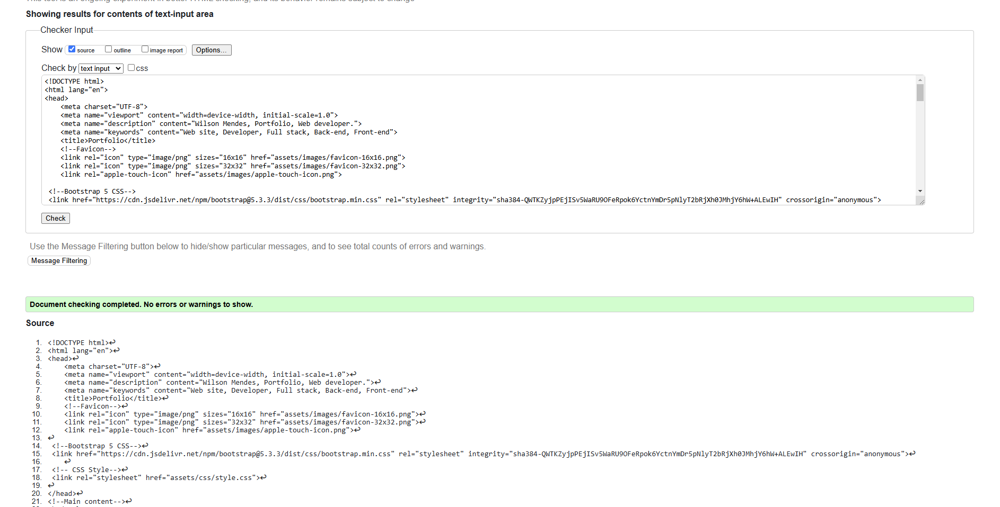
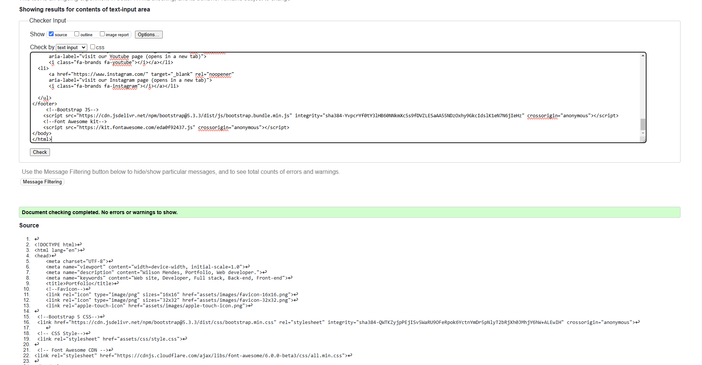
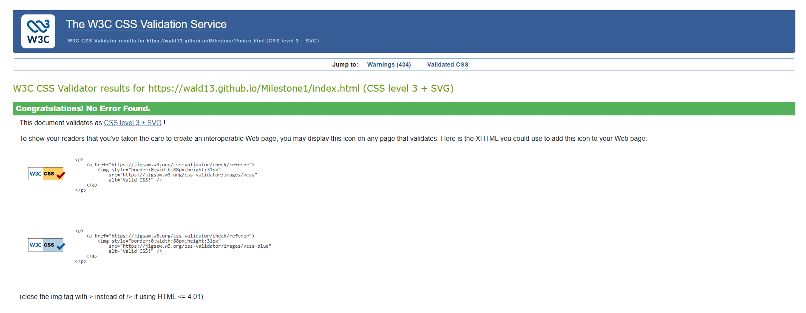
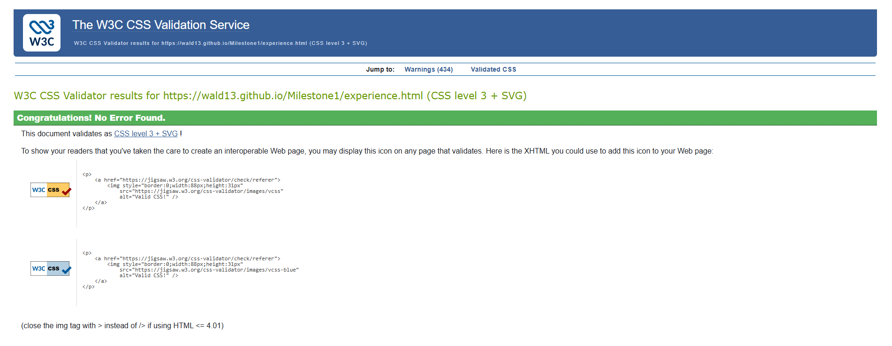
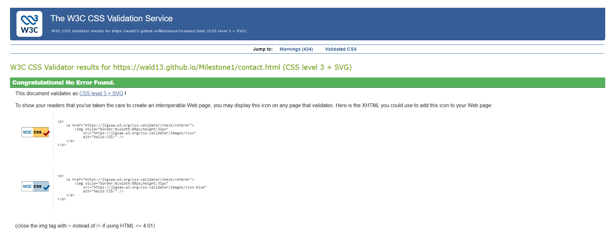

# 🚀 Milestone 1 Portfolio: Wilson Mendes
Welcome! I'm Wilson Mendes, a student in the Level 5 Diploma in Web Development. This repository contains my first portfolio project, serving as a foundational milestone to demonstrate and solidify my front-end development skills.

## ✨ Project Goal & Purpose
### This portfolio project had two primary objectives:

Fundamental Practice: To serve as a practical exercise in building an attractive and engaging single-page website, putting all foundational knowledge into practice.

Future Foundation: To establish a strong, clean code base and design structure that will inform and be scaled up into my future professional portfolio.

## 🎯 Key Features
The website is designed to be fully responsive and user-friendly across all devices.

Professional Layout: Clean, modern design built using the Bootstrap 5 grid system.

Intuitive Navigation: A clear, consistent navigation bar for easy access to the Home, Experience, and Contact sections.

Aesthetic Typography: Enhanced readability and design provided by Google Fonts.

Iconography: Use of Font Awesome to provide visual cues and modern flair.

## 🌐 Deployment process:
Running the project locally:
1. Ensure you have a GitHub account [Create one here](https://docs.github.com/en/get-started/start-your-journey/creating-an-account-on-github).
2. Use Google Chrome as the best browser for this deployment.
3. Install VSCode to your computer or open the browser version [here](https://vscode.dev/).
4. Click the 'Open Remote Repository' button on the home page to clone and or edit as you wish.

To do the above you may need to follow these steps also:
1. Open the repository in GitHub [here](https://github.com/Wald13/Milestone3)
2. Click on the "Code" icon'.
3. Select "GitHub CLI".
4. Copy the CLI "gh repo clone (Name of the project).
5. Paste it in vscode terminal.

## 🛠️ Technologies & Tools
This project was built using a robust modern stack of foundational web technologies and frameworks:
 
 1. HTML 
 
 2. CSS 
 
 3. Bootstrap 5 (https://getbootstrap.com/)
 

 ## Web sources:

 1. Googlefonts (https://fonts.google.com/)
 2. Fontawesome (https://fontawesome.com/)
 3. favicon (https://favicon.io/) 

 # Wireframe:

Wireframe 

# CSS and HTML validation:

## HTML Files:

### Index (home) page:

### Experience page:

### Contact page:

## CSS File:

### Index (Home) Page:

### Experience page:

### Contact page:

# Lighthouse validator:

### Home Page:
https://pagespeed.web.dev/analysis/https-wald13-github-io-Milestone1/9ktzv843nk?form_factor=mobile

### Experience Page:
https://pagespeed.web.dev/analysis/https-wald13-github-io-Milestone1-experience-html/4r2wywstiv?form_factor=mobile

### Contact Page:
https://pagespeed.web.dev/analysis/https-wald13-github-io-Milestone1-contact-html/twvamxxnbg?form_factor=mobile

## ⚠️ Important Note on Development History
This project was originally initiated under a different repository name (https://github.com/Wald13/Project-1.git). Due to technical issues encountered while migrating the project environment from Gitpod to VS Code, some unexpected errors occurred. As a result, the initial commits in this repository are a direct copy of the functional code that was salvaged from the previous project.

# 🌐 View the Live Project
Explore the finished website hosted on GitHub Pages:

https://wald13.github.io/Milestone1/

### (https://wald13.github.io/Milestone1/)